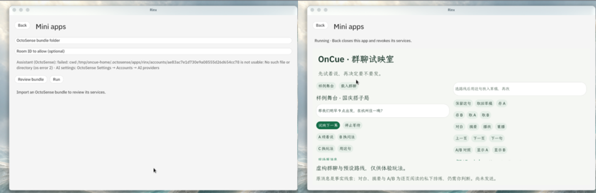

# OnCue · 群聊试映室

**先试着说，再决定要不要发。**

> ## 📌 组委会强调的官方资料（逐一标记，均已核实可达）
>
> **初赛交三样，截止 2026-10-06 23:59**：① 自己的代码仓库 ② App Hub 提交 ③ 自己的 app 录屏。
> 不符合要求的当弃赛处理。以下每份都逐字读过，不是只看了摘要。
>
> | 资料 | 链接 | 用它做什么 |
> | --- | --- | --- |
> | **OctoSense 应用开发到发布（app flow）** | <https://github.com/OctoSense-org/OctoScript-App-Design-Flow/blob/main/README.zh-CN.md> | **主入口**。从制作到发布的全部说明：快速上手、`tools/octo`、脚本 API、设计流程、发布 |
> | **Rinx 赛道参考文档** | <https://github.com/gosimfoundation/hackathon-agenticapp26/blob/main/docs/rinx-guide.md> | 张老师点名"做 rinx 赛道参考这个文档"：Rinx 的 Matrix 注册与使用说明 |
> | **App Hub 发布契约** | <https://github.com/OctoSense-org/OctoSense-App-Hub/blob/main/docs/PUBLISHING.md> | 应用包格式、准入检查、签名、提交与商店的完整规范 |
> | **第一个 Hub 应用演练** | <https://github.com/OctoSense-org/OctoSense-App-Hub/blob/main/docs/FIRST-APP.md> | 从空仓库到过门禁的完整走法 |
> | **App Hub 提交指南（赛事侧）** | <https://github.com/gosimfoundation/hackathon-agenticapp26/blob/main/docs/app-hub-submission.md> | 作品提交与运行验收：材料 6 项、按形态交付、验收六项 |
> | **Rinx 小程序基线** | <https://github.com/gosimfoundation/hackathon-agenticapp26/blob/main/docs/rinx-miniapps.md> | Rinx 小程序的授权机制、选手起步 5 步、基线提交 |
> | **黑客松官网** | <https://create.gosim.org/agenticapp26/> | 赛事规则、日程与报名 |
>
> **比赛登记入口（赛事仓库 issues）**：#5《请在这里提交每支队伍的参赛主题》✅ 已提交；
> #13《请在这里提交每支队伍的初赛仓库地址》✅ 已提交（含 MiniMax 团队 ID）。
>
> **我们的形态**：OctoScript 脚本应用（判定依据是包根目录有 `main.splash`，见上面 app flow 的发布契约），
> 跑在 Rinx 小程序宿主内，经 App Hub 发布。**参赛作品就是 [`oncue/bundle/`](oncue/bundle/)** ——
> 仓库里其余的 `.py` 只是测试与原生驱动工具，不是作品，也不是网页或独立 Rust 应用。

> **当前 main：0.4.7。** 助手不再撰写事实摘要，只选原消息编号，应用取回原文逐字展示并拒绝改写；真实 Rinx 主机两个外窗尺寸下的阅读、播放、草稿恢复，以及 138 项真实 OctoScript 受控测试均已通过。实现边界与未覆盖项见[验证摘要](oncue/VERIFICATION.md)。

把一句还没发出去的话放进私人排练场，看三个不同的下一幕：
**顺着这句 / 换个问法 / 换个玩法**。回看原消息，逐句播放匿名的假设接话，
把喜欢的建议放进草稿，再对照两种写法。

  

  同一应用在 <b>990×613</b>（宽屏）与 <b>412×892</b>（窄屏）两个视口下的排版

队伍 **OnCue** · 成员 **YCOROY** · 赛道 **OctoSense 即时消息 · Rinx**。

参赛作品是 [`oncue/bundle/`](oncue/bundle/)：一个在 OctoSense / Rinx 宿主内运行的
**OctoScript 小程序**，按 App Hub 流程准备发布；当前尚未官方收录。

## 一分钟怎么玩

1. 打开虚构的「国庆搭子局」，试一句「明早 9 点出发，住一晚」——原消息里有人中午才能走、希望当天回来。
2. 改成「中午出发、当天回来，先核实预算」，重新试映，比较三个不同的接法。
3. 选「换个玩法」，把讨论变成半日旅行盲盒：每人给一个想做的事，再找条件的交集。
4. 播放、暂停或逐句查看假设对白，把喜欢的建议放进草稿；改两种写法，分别存 A、存 B，再取回对照。

  

  左：打开虚构样例、回看原消息 · 右：逐句播放「顺着这句」的假设对白

原消息是事实线索，下一幕是假设，未被同意的行程和费用仍需自己核实。

## 在 Rinx 里运行

开发复现用[未签名副本工具](<oncue/tools/prepare_dev_bundle.py>)生成独立副本（不直接导入仓库里的签名包）：在已登录的 Rinx 中打开 **Discover → Mini apps → Import an app**，填入副本路径与**你自己的测试房间**，Review 后 Run。

  

  左：Developer 入口填入包路径与测试房间 · 右：Review 通过后在宿主内运行

当前版本已在 Rinx 外窗 **412×892** 与 **990×613** 下逐页读取真实三路线与摘录；实际应用嵌入区分别为 **376×727** 与 **954×448**，滚动可达、无裁切。

## 数据与边界

- **不发送任何消息**。排练与草稿都只在本地，保存由使用者主动触发。
- **不携带凭据**。Matrix 登录留在宿主、模型凭据留在内核；应用只申请
  `matrix.room_info`、`matrix.read_messages`、`octos.session.open`、`octos.turn.start`、
  `octos.turn.interrupt` 与本地 `storage`，且 `hosts` 为空（不访问任何网络主机）。
- 房间名为空时显示「已授权群聊」，**不回落到完整房间 ID**。
- 来源核对不能保证所有假设或建议符合事实；取材与存储范围见[数据说明](oncue/PRIVACY.md)。

## 文档

- [产品说明](oncue/PRODUCT.md) — 目标、流程与状态反馈
- [数据说明](oncue/PRIVACY.md) — 数据来源、权限与隐私
- [原生工作流](oncue/docs/NATIVE-WORKFLOW.md) — 在宿主里装载与运行
- [宿主环境与复现](oncue/docs/DEPENDENCIES.md) — 宿主版本、支持平台、依赖
- [验证摘要](oncue/VERIFICATION.md) — 当前版本的实测结果与未覆盖项
- **当前版截图**：[包内两张](<oncue/bundle/screenshots/>)——真实 Rinx 主机、真实授权房间与真实助手回合的同版截图，已逐张打开查看。
- [当前版演示](<evidence/submission/DEMO-0.4.7.md>) — 2 分 58 秒真实连续录屏、时间轴与解说词
- [App Hub 材料](evidence/apphub/) — `hub check` 输出与 `hub scan` 七问回答
- [Apache License 2.0](oncue/LICENSE)
