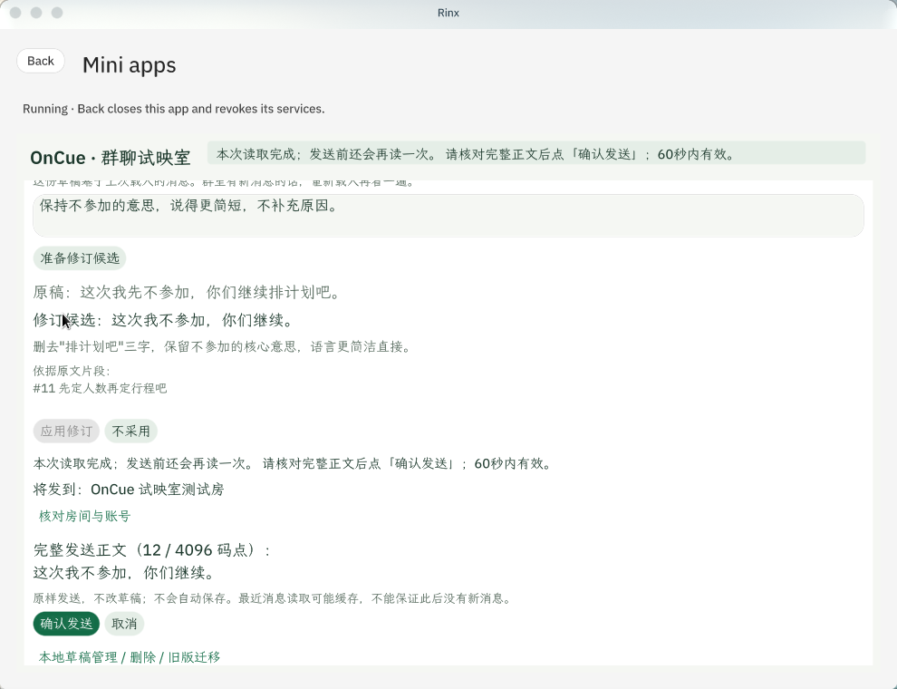

# OnCue · 群聊试映室

**在群里开口之前，先在这里试一下。** 当前版本 **0.5.2（未签名）**。

OnCue 是运行在 Rinx 里的群聊排练工具：选一个表达目标，参考你勾选的群消息，比较三种说法；挑一句改草稿，再决定要不要发到群里。草稿按房间存在本机。

## 助手做什么，程序做什么

**助手只写措辞，事实和执行由程序把关。** 助手根据目标提出候选台词并按修改要求改写；程序负责读取来源、核对身份、执行格式/引用/数字/承诺规则、控制采用、发送和存储。每一步要你确认：允许模型请求是一次确认，应用修订是一次确认，**发到群里是最后一次确认**。

## 流程

| 步骤 | 你做什么 | 失败时怎么办 |
| --- | --- | --- |
| 读群聊 | 点「载入群聊」，勾选本次参考的消息 | 未选房间/未授权/授权过期有中文提示，草稿不动 |
| 试映 | 写台词、选目标、允许本次范围、点「试映下一幕」 | 助手不可用或限流提示原因；改勾选/撤回后要重新允许 |
| 检查 | 对照每条建议和它依据的原文 | 引用或数字不合规则会被拒并说明原因，可重试 |
| 选句、修订 | 「选用这句」进草稿；或提修改要求，候选对照后「应用修订」 | 期间群里来了新消息，旧候选作废并提示重新试映 |
| 确认发送 | 「发到群里」核对房间和全文，点「确认发送」 | 发送期间又来新消息要再确认一次；改一个字确认就作废 |
| 读回核验 | 程序自动读回，按新增消息、你的账号、正文核对 | 最近消息里没看到就说"尚不能确认"，只给「再读一次」，绝不自动重发 |

## 权限

| 能力 | 用途 |
| --- | --- |
| `storage` | 本地草稿按房间保存 |
| `matrix.room_info` | 房间名称与稳定身份 |
| `matrix.read_messages` | 读取授权房间最近消息，核对变化与发送结果 |
| `matrix.account_info` | 当前账号身份（核对"是我刚发的"） |
| `matrix.send_message` | 你确认后向该房间发送原样草稿 |
| `octos.session.open` / `octos.turn.start` / `octos.turn.interrupt` | 助手试映与停止 |

应用不直连网络；Rinx 与宿主模型可能联网并保留历史，本地删除不影响那边。

## 宿主

Rinx `c515e5fc9b6dc22e67f7d551b09fdd793ec685a1`（v1.1.0-3，2026-10-09）。Rinx 打开小程序一小时后或关闭应用后收回授权。

## 验证（详见[验证记录](oncue/VERIFICATION.md)）

- 界面场景 43 次全部通过（38 场景，412×892 与 954×448 双尺寸，宿主回复注入）
- 逻辑测试 12 套 368 项全部通过（真实 card-host 虚拟机，生产函数逐字节复核）
- 工具单元测试 109 项全部通过
- `hub check` 通过（仅未签名警告）
- 真实 Rinx：6 次真实模型试映、授权状态 4 项实拍、完整流程含真实发送 1 条并读回确认

## 界面

<p align="center">
  
</p>
<p align="center"><sub>宽窗口和窄窗口下的界面</sub></p>

真实 Rinx 中的发送确认区与结果（[更多实机证据](evidence/native-052/)）：



## 一分钟怎么玩

1. 打开本地样例，写一句想接的话，选「澄清条件」「礼貌拒绝」或「推动下一步」，点「试映下一幕」。
2. 比较三种说法，「选用这句」放进草稿；假设对白可另行播放。
3. 改草稿或提修改要求，候选对照后「应用修订」；保存是独立动作（保留这句/存 A/存 B）。
4. 点「发到群里」核对房间和全文，「确认发送」后程序读回核验；草稿始终在你手里，发送不自动保存也不清空。
5. 样例的三种说法和修订是本地固定演示，不调用模型；真实房间要先允许模型请求。

演示录影为 0.4.8 时期录制，界面以当前截图为准。

## 在 Rinx 里运行

**从 App Hub 安装**：Rinx 的 **Discover → Mini apps** 进入应用库，找到 OnCue 后 **Add**、**Open**；打开时宿主列出申请的八项服务和所选房间，确认后授权本次运行。

**本地导入**（不接受已签名包，先生成未签名副本）：

```sh
export OCTO_HUB=/path/to/OctoSense-App-Hub/target/release/hub
DEV_ROOT="$(mktemp -d)"
python3 oncue/tools/prepare_dev_bundle.py "${DEV_ROOT}/bundle" --hub "$OCTO_HUB"
```

在 Rinx 里打开 **Discover → Mini apps → Import an app**，填入打印出的目录与你的房间 ID，**Review** 核对名称、版本、八项服务与 Allowed room 后 **Run**。每次打开都要重新授权。

## 复赛版本改了什么

评审四条建议的对应：授权到期/拒绝授权行为已实测并记录在案（`evidence/native-052/auth-ui-results.json`）；数字检查扩展到中文数字与复合单位；应用包移到仓库根目录 `bundle/`；改用 GitHub 发布流程（tag 触发，`publish-app.yml` 已就位）。另加确认发送与新消息复核两项能力及界面场景测试。

## 对 OctoSense 的贡献

1. **splash-app-verify Skill**：把"先写界面契约和场景、再写代码、每改一次全量跑场景"变成 Splash 应用的标准做法；今天它帮 OnCue 在交付前抓到 5 个真 bug（错误归因、限流翻译、两处状态与界面脱节）。13 号随 App Flow 提交 PR。
2. **Palpo 密钥备份 404 复现**：开密钥备份的账号邀请任何人到新房间都失败（规范要求 200 空 sessions，Palpo 返回 404），最小复现已写进[验证记录](oncue/VERIFICATION.md)。
3. App Flow 文档的一处写法问题（链接待提交后补充）。

## 尚未验证

- ~~61 分钟授权过期实测~~ 已实测：Rinx 在授权到期后结束小程序会话（界面显示 Session ended）；应用内"授权已过期"提示由界面场景 04a 和 envelope 注入测试覆盖（[实测记录](evidence/native-052/expiry-record.json)）
- 跨账号"群里有新消息"实机演示（已由界面场景注入覆盖）
- macOS、Windows、移动端；商店安装；并发写入与断电一致性

## 文档

- [产品说明](oncue/BRIEF.md) · [数据说明](oncue/PRIVACY.md) · [运行说明](oncue/docs/RUNNING.md)
- [验证记录](oncue/VERIFICATION.md) · [测试说明](oncue/tests/README.md)
- [更新记录](CHANGELOG.md) · [审核问答](build/REVIEW-ANSWERS.md)
- [Apache License 2.0](LICENSE)
