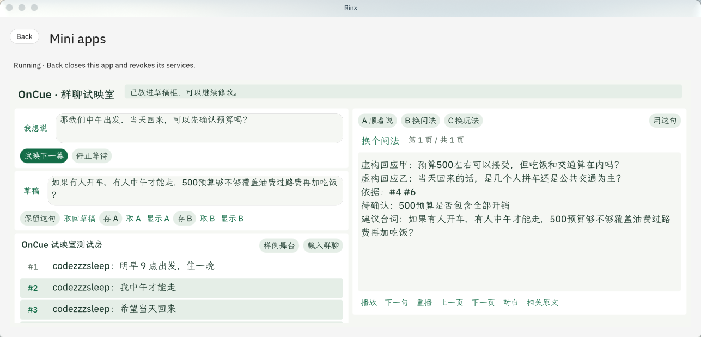
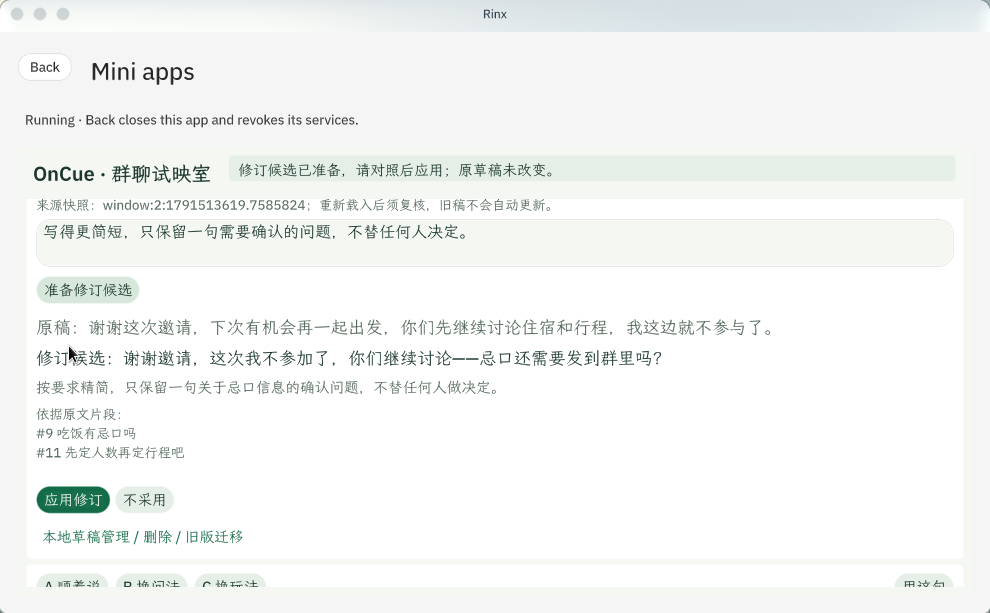
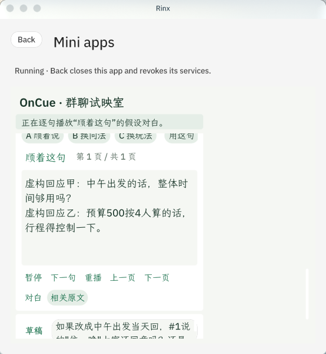

# OnCue · 群聊试映室

**先试着说，再决定要不要发。**

OnCue 是运行在 Rinx 里的私人群聊排练工具。选择表达目标和参考消息，比较三种说法；手工编辑或继续修订，对照后应用，按房间保存主稿与A/B。**发到群里前，要先核对房间和全文，再点击确认。**

当前分支为 **0.5.1 未签名审阅版**；已在真实Rinx与宿主模型中完成生成、修订、保存及重开恢复。商店版本与下方既有录屏/组合图为0.4.8。实际验证范围见[验证记录](oncue/VERIFICATION.md)。

演示录屏：[2 分 08 秒](evidence/demo/oncue-demo.mp4)

<p align="center">
  
</p>
<p align="center">
  <sub>宽窗口和窄窗口下的界面</sub>
</p>

当前未签名审阅包在 [`oncue/bundle/`](oncue/bundle/)。

## 当前实际界面

真实Rinx中的模型修订候选，核对后再应用：



重新打开并载入同一房间后，可继续使用保存的稿件。三建议速览和A/B对照仍可用于不调用模型的[本地样例](evidence/semifinal-050/02-overview.png)。

## 一分钟怎么玩

1. 打开本地样例，写一句想接的话，选「澄清条件」「礼貌拒绝」或「推动下一步」。
2. 点试映直接比较三句，选一句放入草稿；假设对白可另行播放，不用播完再选。
3. 修改草稿、比较前后，存主稿或A/B。样例修订候选是固定模板，只演示对照与应用交互。
4. 在真实房间中，先勾选来源并允许模型请求，再试映或提出修订要求。修订先展示候选与依据，明确应用才改稿，保存仍是独立动作。
5. 草稿管理提供按房间删除和旧版主稿/A/B手动迁移；旧稿不会自动归入当前群聊。

<p align="center">
  
</p>
<p align="center">
  <sub>左：打开内置样例、回看群聊消息 · 右：逐句播放「顺着这句」的假设对白</sub>
</p>

三种说法是助手的假设，不是群友的真实回复。

## 在 Rinx 里运行

**从 App Hub 安装**

在 Rinx 的 **Discover → Mini apps** 进入 App Hub 应用库，找到 OnCue 后 **Add** 安装、**Open** 打开；打开时宿主会列出应用申请的六项服务和所选房间，确认后为本次运行授权。上架申请：<https://github.com/OctoSense-org/OctoSense-App-Hub/issues/78>。

**本地导入**

Rinx 的本地导入不接受已签名的包，先生成一份未签名副本：

```sh
# OCTO_HUB 指向本地构建的 hub，可执行文件的构建方法见 OctoScript-App-Design-Flow 的 QUICKSTART
export OCTO_HUB=/path/to/OctoSense-App-Hub/target/release/hub
DEV_ROOT="$(mktemp -d)"
python3 oncue/tools/prepare_dev_bundle.py "${DEV_ROOT}/bundle" --hub "$OCTO_HUB"
```

1. Rinx 里打开 **Discover → Mini apps → Import an app**。
2. 包路径填上一步打印出的目录，房间填你自己的 Matrix 房间 ID。
3. **Review** 核对名称、版本、六项服务与 Allowed room → **Run**。

每次打开都要重新授权，关闭后授权失效。完整步骤见[运行说明](oncue/docs/RUNNING.md)。

## 数据与权限

- **申请的八项能力**：`storage`（本地草稿）、`matrix.room_info` 与 `matrix.read_messages`（授权房间及最近消息）、`matrix.account_info`（当前账号身份核对）、`matrix.send_message`（用户确认后发送）、`octos.session.open` / `octos.turn.start` / `octos.turn.interrupt`（助手试映与停止）。
- **发送条件**：确认区显示目标房间和完整草稿；改字后必须重新确认。发送前读取基线，发送后用新增事件、当前账号和正文读回核验。超过 500 个 Unicode 码点只核对前 500 个。未确认送达时不自动重发，也不自动保存或清空草稿。
- **模型数据**：勾选消息的原始编号/正文、台词和目标；修订另含原稿与要求。宿主可能联网、保留历史和提供工具，应用不保证每次打开会话清空历史。详见[数据说明](oncue/PRIVACY.md)。
- **草稿**按账号/房间保存，最多10个房间，提供明确删除；存储损坏或结果不确定时停写，保留编辑内容。
- **检查**：原文由程序取出，模型只选编号。逐路线检查引用、有限数字/单位和承诺用语，失败最多修复一次。检查不能证明语义正确，人工编辑不会继承候选检查状态。

## 验证

- 工具单元测试与应用逻辑测试分开。逻辑测试把生产函数原样放进真实card-host运行，仅宿主返回值受控注入，存储和计时不模拟。
- 本分支的包检查、八套逻辑测试及本地交互记录集中在[验证记录](oncue/VERIFICATION.md)，重跑方法见[测试说明](oncue/tests/README.md)。CI不执行完整宿主应用测试。
- 0.4.8的真实Rinx、真实模型记录保留为历史基线，不作为当前版本验收。

## 尚未验证

未运行的平台、真实模型和用户试用项目统一列在[验证记录](oncue/VERIFICATION.md)的「未验证」中；不将规则检查当作全面事实核验。

## 文档

- [产品说明](oncue/BRIEF.md)
- [数据说明](oncue/PRIVACY.md)
- [运行说明](oncue/docs/RUNNING.md)
- [验证记录](oncue/VERIFICATION.md)
- [测试说明](oncue/tests/README.md)
- [演示录屏说明](evidence/demo/README.md)
- [更新记录](CHANGELOG.md)
- [App Hub 审核七问](build/REVIEW-ANSWERS.md)
- [Apache License 2.0](LICENSE)
