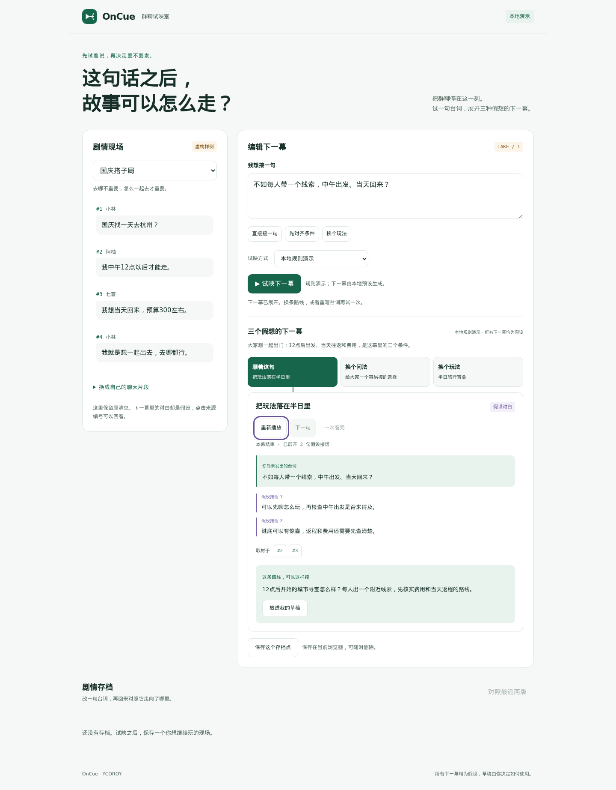

# OnCue · 群聊试映室

**先试着说，再决定要不要发。**

一句还没发出去的话，可以走向三个不同的下一幕：**顺着这句 / 换个问法 / 换个玩法**。
OnCue 把群聊变成一个私人排练场：回看原消息，试写台词，播放匿名的假设接话，
把喜欢的路线放进草稿，再对照改写前后的两版。

队伍 **OnCue** · 成员 **YCOROY** · 赛道 **OctoSense 即时消息 · Rinx**。



## 开始体验

在仓库根目录运行，无需图形桌面或额外 Python 依赖：

```bash
python3 oncue/server/app.py
```

浏览器打开 `http://127.0.0.1:8787/`。默认是明确标记的本地规则演示。
使用服务器上已配置的模型凭据时：

```bash
MINIMAX_API_KEY_FILE=/absolute/path/minimax.key python3 oncue/server/app.py
```

Key 文件保存在仓库外。模型模式在页面中单独选择，每次试映需要确认取材。
完整服务器部署说明见 [运行说明](oncue/README.md)。

## 一分钟怎么玩

1. 打开“国庆搭子局”，试映默认的“明早9点出发，住一晚”。回看原消息中的中午出发和当天返回条件。
2. 改成“中午出发、当天回来，先核实预算”，重新试映。比较同一句话改写后的走向，保存这版。
3. 切换“换个玩法”，看看半日旅行盲盒的开场。播放可以暂停、逐句展开，也可以一次看完。
4. 把喜欢的建议放进自己的草稿，继续编辑并保存；保存两版排练后，打开“对照最近两版”。

演示模式使用规则和预设；模型模式会真正创作。两者在界面中明确标记。
播放、切换路线和恢复存档会重用已有结果，不额外请求模型。

## OctoSense / Rinx 原生版本

`oncue/bundle/` 是原生 OctoScript 小程序，使用 Rinx 的授权房间读取服务和
OctoSense 的共享 Octos Agent。账号留在宿主，模型凭据留在内核，小程序不携带凭据。

在 Rinx 登录后，打开 **Mini apps → Import an app**，附加自己的测试房间，
Review 后 Run。首次进入可先玩虚构样例。固定版本的 Developer 入口会拒绝未受信任的签名；
当前仓库正式包保持签名，开发联调用仓库外、内容摘要相同的无签名副本。
具体导入方式与判据见 [原生验收步骤](oncue/docs/NATIVE-WORKFLOW.md)
和 [固定版本导入说明](evidence/RUNBOOK-step10-11.md)。

## 当前实测范围

开发和交付以 `main` 为主线。运行证据对应提交保存，不把代码存在视为功能通过。

| 范围 | 当前结果 |
| --- | --- |
| 浏览器完整播放流程 | 实际 Chromium 148.0.7778.0 的18项检查通过；暂停、逐句、重播、切换、存档恢复、320px和深色均有证据，console/page errors为0 |
| MiniMax 服务器接入 | 实际 HTTP 200，返回三条路线，来源摘录逐字核对通过 |
| 后端条件与错误处理 | 19 项检查通过，包含开场与路线区分、实测住宿反例、自定义消息、权限和模型错误 |
| 原生样例和草稿 | 样例三路线与播放已有运行记录；0.4.0空档恢复按钮已独立验证，保存、回读和关闭恢复继续联调 |
| Rinx 原生闭环 | 登录与本人测试房间双向消息已有报告；同一OnCue实例的12条读取和共享Octos七块剧本回合尚待证明 |

详细记录见 [验证记录](oncue/VERIFICATION.md)，原始浏览器证据在 `evidence/`。

```bash
python3 -m unittest discover -s oncue/tests -v
# 在已有 Playwright + Chromium 的验证环境中，对运行中的服务器检查播放功能：
python3 evidence/playback_check.py --url http://127.0.0.1:8787/
```

## 数据与源码

原消息是事实线索，下一幕始终是假设。来源摘录核对和条件提醒不能保证整个剧本符合事实。
草稿和存档由使用者主动保存，应用没有自动发送群消息的能力。
取材、存储和模型请求的具体范围见 [数据说明](oncue/PRIVACY.md)。

- [产品说明](oncue/PRODUCT.md)
- [服务器与模型接入](oncue/README.md)
- [原生开发包](oncue/bundle/)
- [Apache License 2.0](oncue/LICENSE)
